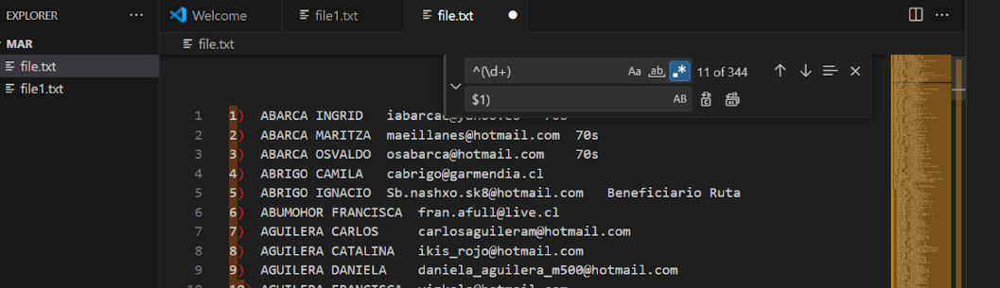
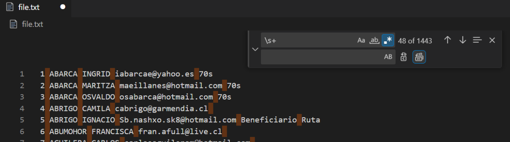
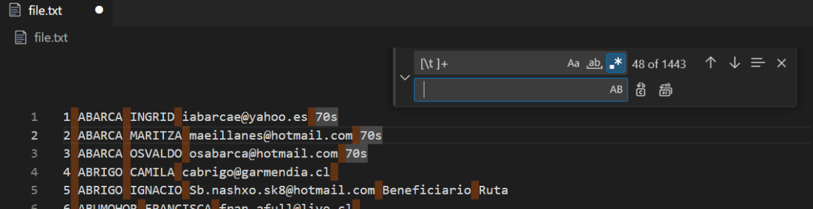
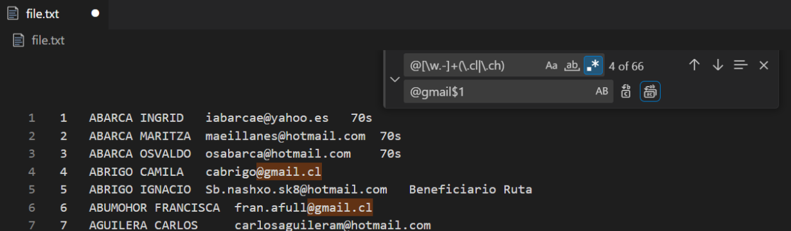
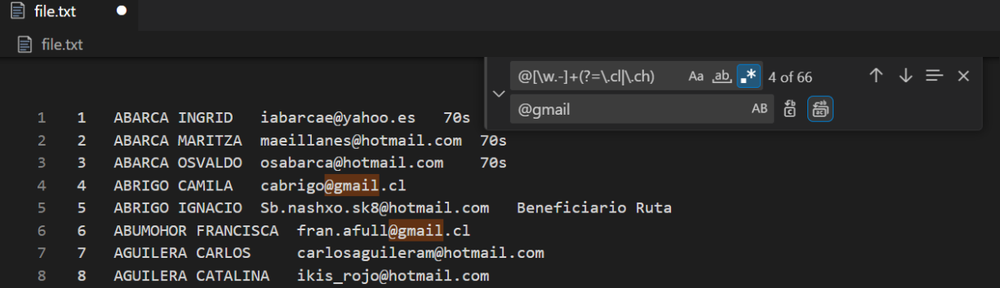
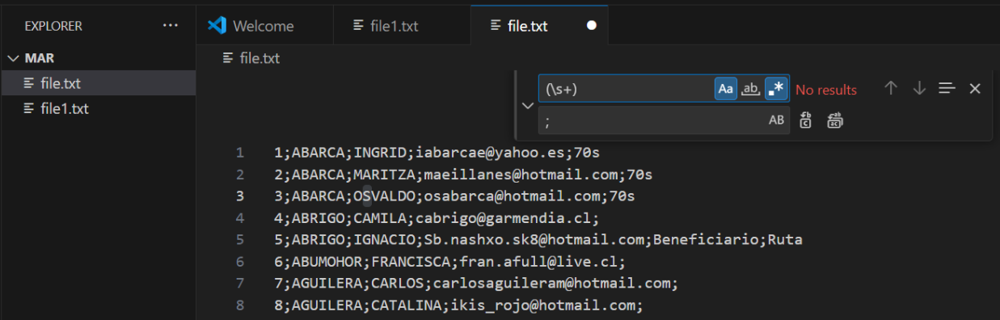
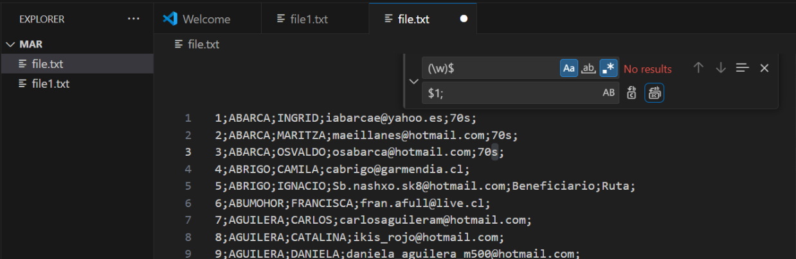

# Ejercicios de regex

## Ejercicio 1
He seleccionado los números del principio de cada línea y al final de estos he añadido el parentesis.
```
^(\d+)
```




## Ejercicio 2
He seleccionado cada grupo de espacios y los he sustituido por un solo espacio.
```
\s+
```



#### Ampliación
Otra forma que he encontrado ha sido mediante las tabulaciones horizontales.
```
[\t ]+
```



## Ejercicio 3
He buscado la cadena de carácteres entre el @ y el .cl / .cl y la he sustituido por gmail.
```
@[\w.-]+(\.cl|\.ch)
```



#### Ampliación
He utilizado el lookahead en el regex del apartado anterior y así al hacer la sustitución no necesito referenciar a .cl/.ch.
```
@[\w.-]+(?=\.cl|\.ch)
```



## Ejercicio 4
He dividido la expresión en tres grupos. El primer grupo captura todo el contenido a la izquierda del correo electrónico, el segundo grupo contiene el propio correo electrónico, y el tercer grupo recoge todos los caracteres a la derecha del correo. Finalmente, he sustituido toda la línea solo por el email.

```
(.*\s)([\w._-]+@[\w-]+.[\w.]+)(.*)
```


## Ejercicio 5
Primero he sustituido los espacios en blanco por punto y coma. A continuación, he añadido el punto y coma al final de todas las líneas que no lo tenían.

